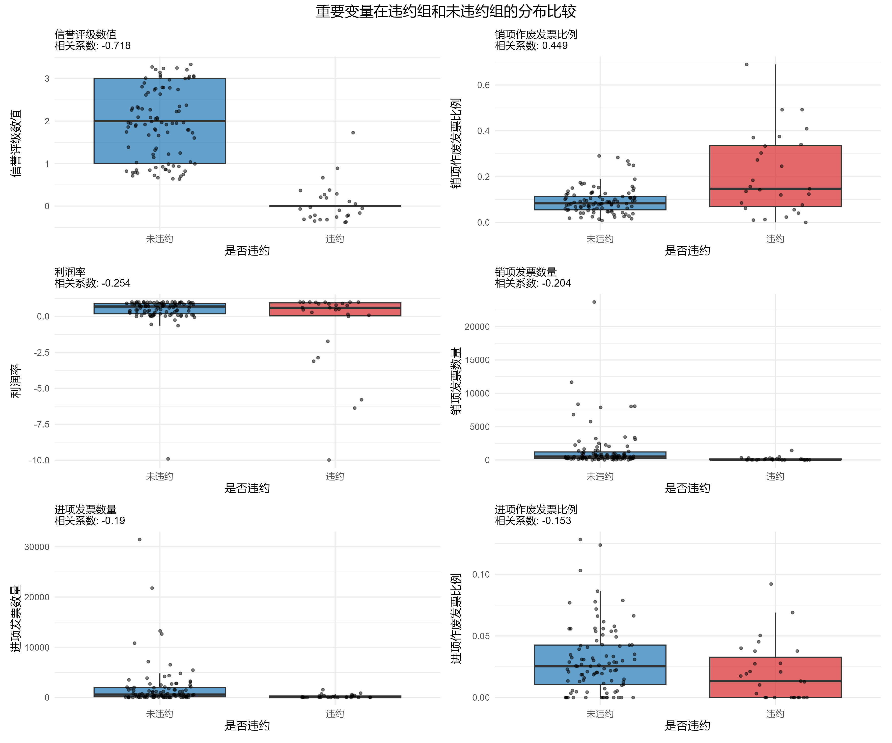
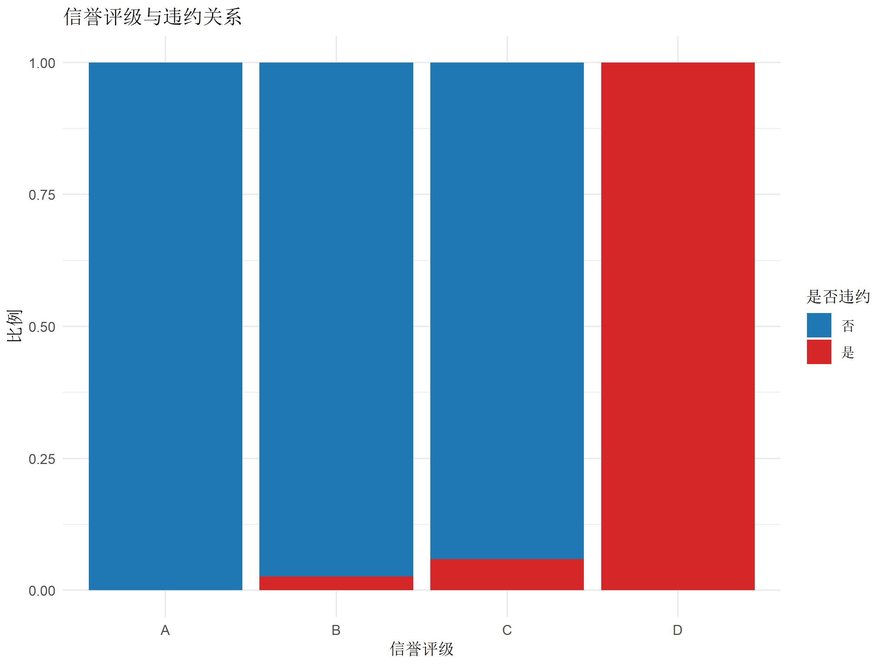
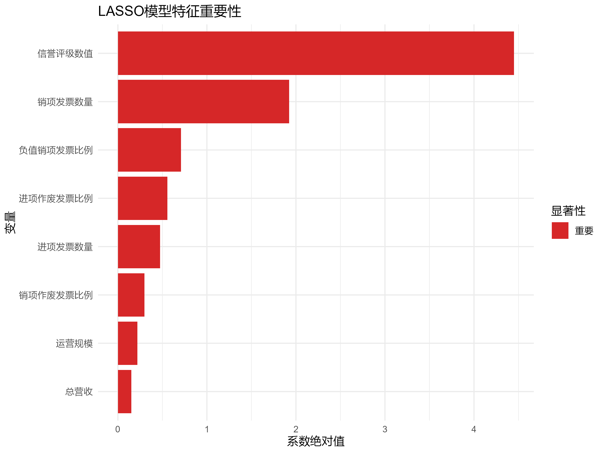
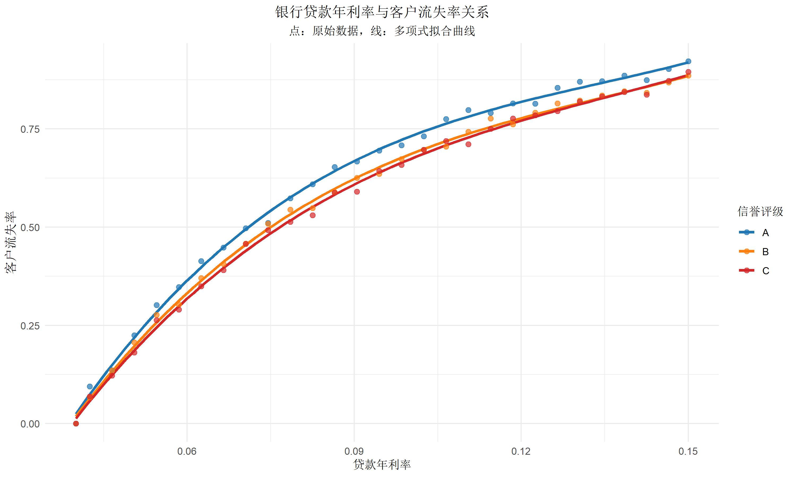

# **基于 R 的中小微企业信贷决策分析与建模**

（统计分析与建模 · 期末大作业）

---

## **1. 项目背景与数据来源**

项目主要目标：

1. 构建一个**可解释的违约概率模型**
2. 利用附件 3 建立利率–流失率回归模型
3. 在预算约束下，完成**信贷额度与利率策略优化**

整个项目的代码与结果已放在 GitHub：
👉 [https://github.com/SOLDIER-627/Credit_Risk_Analyzer](https://github.com/SOLDIER-627/Credit_Risk_Analyzer)

---

## **2. 数据预处理与特征构造**

项目最大的难点在于：

* 发票不是直接指标，而是原始流水
* 金额可能为负（红冲）、发票可能作废
* 有些企业发票数量极少，有些非常多

### **2.1 发票清洗：把“垃圾数据”先剔除**

刚开始简单合计发票金额会出现很离谱的情况：

* 部分企业“总营收是负的”
* 有的企业发票数量为 0

原因主要有两类：

1. **作废发票没有过滤掉**
2. **负数金额的红冲发票直接被计为“负营收”**

解决方式：

* 仅保留 `有效发票`
* 金额统一取**绝对值**
* 对进项/销项分别聚合

这一步处理完后，营收、支出等指标变得合理很多。

---

### **2.2 构造企业财务特征**

从发票信息中，构造了几类核心指标：

* **总营收**、**总支出**（分别来自销项/进项）
* **毛利润 = 总营收 - 总支出**
* **运营规模 = 总营收 + 总支出**
* **发票数量（进项/销项）**
* **作废发票比例**
* **负值发票比例**
* **发票金额变异系数（CV）**

其中作废发票比例和发票金额波动性是在风控视角较有意义的指标。

---

## **3. 探索性分析（EDA）**

探索性分析主要围绕“**哪些特征与违约相关**”。

---

### **3.1 与违约的 Spearman 相关性**

相关性最高的通常是：

* 收入、利润相关：**负相关**
* 发票异常相关（如作废比例）：**正相关**

这与直觉一致。

---

### **3.2 全量变量相关性热图**

可以看到：

* 金额类变量之间高度相关（共线性明显）
* 与违约的相关性普遍不强，这说明单变量难以区分违约，需要模型组合解释

---

### **3.3 违约 vs 未违约的关键变量比较**

观察到：

* 违约企业的规模与利润大多更低
* 发票作废比例更高
* 金额波动性更大

这些特征后来确实也进入模型的重要项。

---

### **3.4 信誉评级 vs 违约关系**

评级越差违约概率越高，说明**人工评级中确实有有效信息**。

---

## **4. 特征选择策略：为什么用 LASSO**

开始尝试普通逻辑回归时遇到：

* 系数方向不稳定
* 多重共线性严重
* 验证集表现一般

这使我倾向于使用：

### **→ LASSO（L1 正则化）的逻辑回归**

原因：

* 能自动筛掉不重要的特征
* 稀疏化后模型更容易解释
* 更稳定

我用 `glmnet` + 5 折交叉验证选择最优 λ。

---

## **5. LASSO 逻辑回归模型**

### **5.1 系数路径图**

随着 λ 增大，部分特征系数被压缩到 0，模型自然完成特征选择。

---

### **5.2 ROC 曲线**

AUC 明显优于随机水平，即便样本只有 123 家也能体现一定区分能力。

---

### **5.3 特征重要性**

最关键的几个特征方向与 EDA 完全一致：

* **毛利润/营收等越高 → 风险越低**
* **作废发票比例等越高 → 风险越高**

模型既有预测能力，也有较高的解释性。

---

## **6. 利率–流失率拟合与信贷策略模型**

违约概率模型只是第一步，根据项目要求，还需建立完整的信贷策略。

---

### **6.1 利率–流失率拟合**

拟合结果显示：

* 利率越高，客户越容易流失
* A 级客户比 C 级客户更敏感

这为决定利率上限提供依据。

---

### **6.2 构建期望收益函数**

包含三部分：

1. 利息收入
2. 违约损失（假设回收率 30%）
3. 流失损失（利率太高客户跑掉）

期望收益大致为：

$$
E_i = \left[L_i r_i (1-p_i) - L_i p_i (1 - 0.3)\right] \times \left(1 - \mathrm{流失率}(r_i)\right)
$$

---

### **6.3 信贷策略优化：在预算约束下分配贷款**

思路是：

* 优先给**收益密度高**的企业
* 对评级高但敏感的客户不能乱提利率
* 对高违约概率企业削减额度

最终的策略可视化如下：

可以看到：

* 高违约概率客户的额度更低
* 预算优先给低风险高收益客户
* 策略整体收益最优

---

## **7. 个人总结与反思**

这一学期最大的收获主要有：

### **（1）第一次深刻体会“预处理比建模更难”**

尤其是面对发票这种“半结构化数据”，真正难点不在模型，而在：

* 让数据可用
* 构造能解释的特征

### **（2）数据量不大，模型不能太复杂**

简单模型反而更稳定。

### **（3）LASSO 很适合小样本高相关特征的场景**

不需要人工筛选特征，自动给出稀疏模型。

### **（4）策略部分比我想象的重要**

违约概率只是一个输入，真正“决策”需要结合利率与流失率。

### **（5）如果重做，我会：**

* 尝试更合理的缺失处理
* 加入岭回归、随机森林做对比
* 使用线性规划替代贪心策略
* 增加特征如行业、地区等分类信息

---

## **8. 项目代码与结果仓库**

所有脚本、生成的 CSV、模型文件、图片都在：

👉 [https://github.com/SOLDIER-627/Credit_Risk_Analyzer](https://github.com/SOLDIER-627/Credit_Risk_Analyzer)

---
