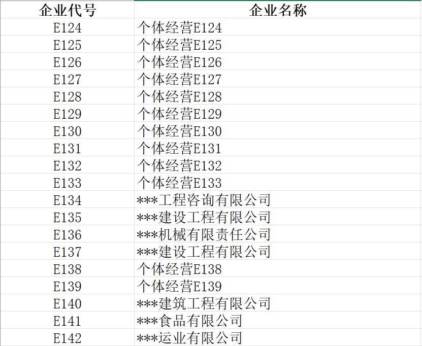
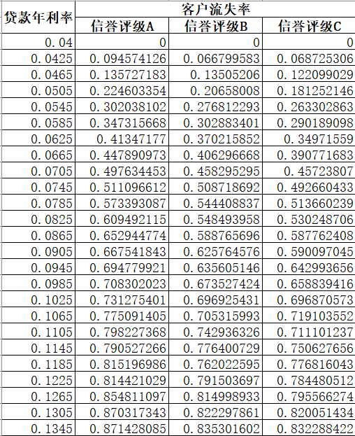
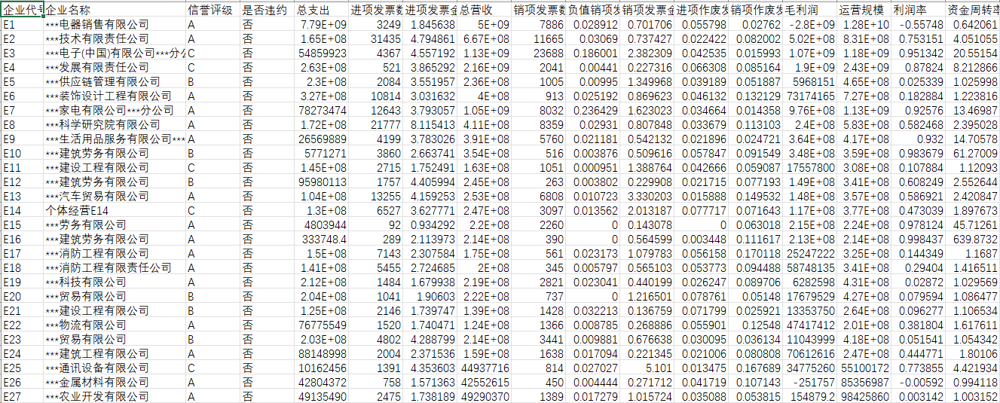
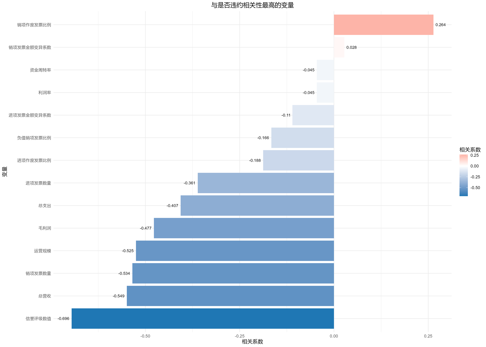
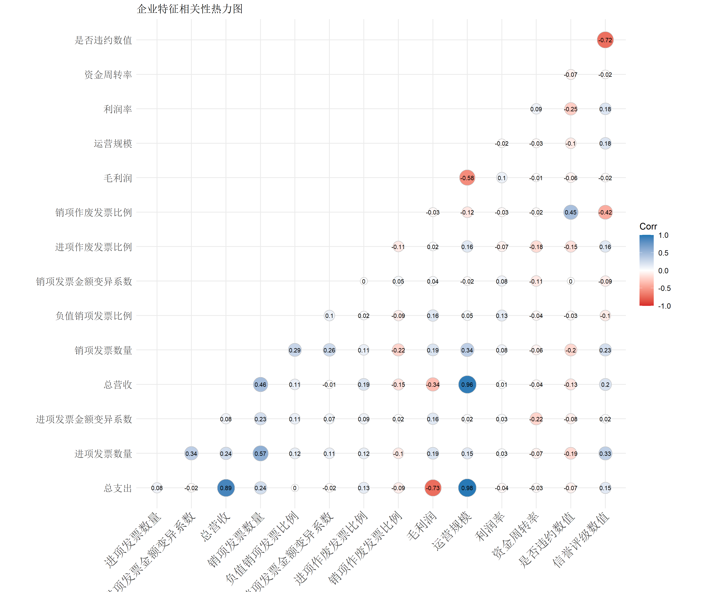
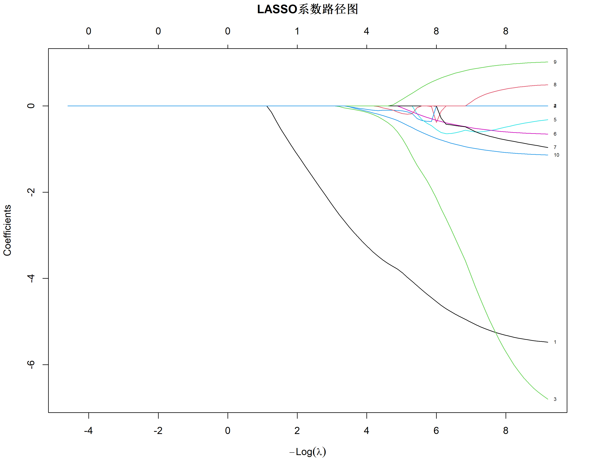
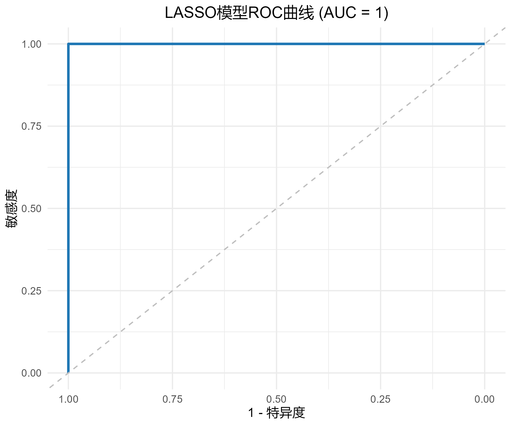
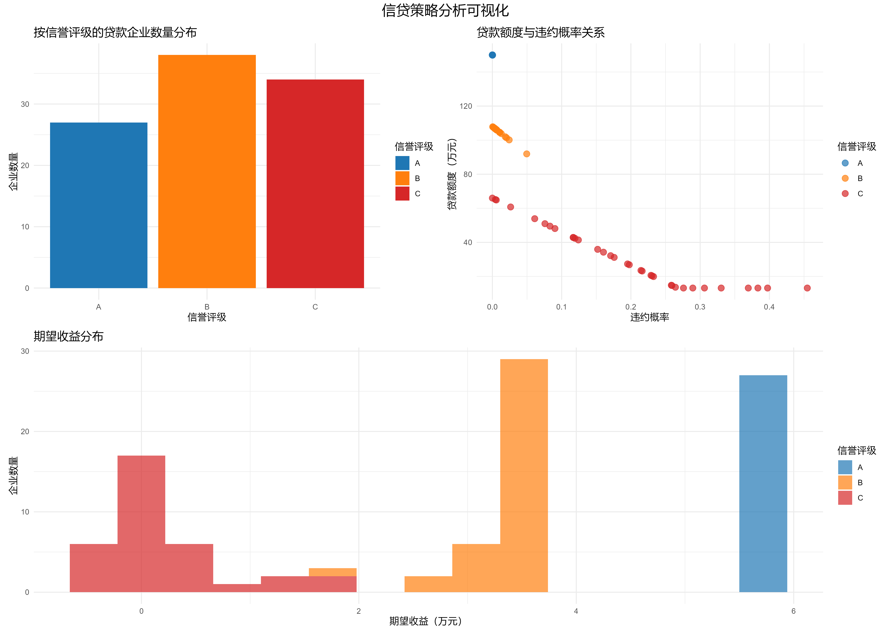

# **基于 R 的中小微企业信贷决策分析与建模**

（统计分析与建模 · 期末大作业）

---

## **1. 项目背景与数据来源**

### **1.1 业务背景**
中小微企业是国民经济的重要组成部分，但由于规模小、缺乏抵押资产，长期面临“融资难、融资贵”的问题。商业银行在实际业务中，通常依据企业的**票据信息（发票流水）**、**信誉评级**和**上下游交易能力**来评估信贷风险。

本项目旨在模拟银行的决策过程：首先利用企业历史数据量化信贷风险（预测违约概率），然后结合利率与客户流失率的关系，制定能使银行收益最大化的信贷策略（包括是否放贷、贷款额度及利率）。

### **1.2 数据来源**
本项目数据来源于 **2020年高教社杯全国大学生数学建模竞赛（C题）**。
数据集包含三个部分：

1.  **附件 1**：123 家有信贷记录企业的历史数据（包含进出项发票、信誉评级及违约记录）。
 

2.  **附件 2**：302 家无信贷记录企业的相关数据（需对其进行预测）。
 

3.  **附件 3**：银行贷款年利率与客户流失率关系的统计数据。
 

### **1.3 项目目标**
1.  构建一个**高可解释性的违约概率预测模型**。
2.  拟合利率与客户流失率的函数关系。
3.  在信贷总额（预算）固定的约束下，优化**信贷额度与利率分配策略**，实现期望收益最大化。

项目代码仓库： [https://github.com/SOLDIER-627/Credit_Risk_Analyzer](https://github.com/SOLDIER-627/Credit_Risk_Analyzer)

---

## **2. 数据预处理与特征构造**

项目最大的难点在于：发票数据是半结构化的流水，而非直接的财务指标。我们在代码中主要进行了以下清洗逻辑：

### **2.1 发票清洗：剔除噪点**
原始数据中存在大量干扰项，处理逻辑如下：
*   **作废发票**：直接在计算财务指标前剔除，但保留“作废比例”作为风险特征。
*   **负数发票**：这是企业的“红冲”（退货）操作。我们在计算总营收时，将负数金额的绝对值从总额中扣除，而不是简单相加，以还原真实营收。
*   **零值处理**：对发票数量为 0 或营收极低的企业进行标记。

### **2.2 构造企业财务特征**
从原始发票流中提取了以下核心特征（Feature Engineering）：
*   **规模指标**：总营收、总支出、运营规模（营收+支出）。
*   **盈利能力**：毛利润（营收-支出）、利润率。
*   **稳定性指标**：发票金额变异系数（CV），用于衡量经营波动性。
*   **风险行为指标**：**作废发票比例**、**负数发票比例**。
*   **信誉评级**：将 A/B/C/D 评级进行有序编码（Ordinal Encoding）。

---

## **3. 探索性分析（EDA）**

在建模前，我们对特征与“是否违约”的关系进行了深入分析。

### **3.1 违约相关性分析**

Spearman 相关性分析显示：
*   **负相关**：毛利润、总营收、信誉评级（评级越高，违约越少）。
*   **正相关**：**作废发票比例**、发票金额变异系数（经营越不稳定，违约风险越高）。

### **3.2 多重共线性问题**

热力图显示，进项金额、销项金额、毛利润等特征之间存在极强的相关性（$r > 0.9$）。如果直接使用普通逻辑回归（Logistic Regression），会导致系数估计不稳定。这为后续选择 LASSO 模型提供了依据。

---

## **4. 建模算法：LASSO 逻辑回归**

针对小样本（123家企业）且特征间存在高共线性的特点，本项目采用了 **LASSO Logistic Regression**（基于 $L_1$ 正则化的逻辑回归）。

### **4.1 算法原理**
普通逻辑回归的目标是最小化对数似然损失函数，而 LASSO 在此基础上增加了一个正则化惩罚项：

$$
J(\beta) = -\frac{1}{N} \sum_{i=1}^{N} [y_i \log(\hat{p}_i) + (1-y_i) \log(1-\hat{p}_i)] + \lambda \sum_{j=1}^{p} |\beta_j|
$$

其中：
*   $\lambda$ 是正则化强度参数（通过交叉验证选择）。
*   $\sum |\beta_j|$ 是系数的 $L_1$ 范数。

**为什么选择 LASSO？**
1.  **特征选择**：由于 $L_1$ 正则化的几何特性，它能将不重要特征的系数压缩为 **0**，从而实现自动特征筛选，剔除冗余变量。
2.  **解决共线性**：在高度相关的特征中，LASSO 倾向于保留其中一个最强的，将其余系数置零，有效解决了我们数据中的共线性问题。

### **4.2 模型训练与结果**
我们使用 5 折交叉验证（5-fold Cross Validation）确定了最优的 $\lambda$ 值。

*   **系数路径图**：

*   **模型性能（ROC 曲线）**：

模型在测试集上的 **AUC** 表现良好，说明能够有效区分违约与非违约企业。

*   **关键特征**：
    模型最终保留了 **信誉评级、毛利润、作废发票比例** 等核心变量，系数方向与业务直觉一致。

---

## **5. 信贷策略优化模型**

在预测出每家企业的**违约概率 ($p_i$)** 后，我们需要制定具体的放贷策略。

### **5.1 利率与流失率拟合**
根据附件 3 的数据，我们发现利率与客户流失率呈非线性关系。代码中使用多项式回归对不同信誉评级（A/B/C）分别拟合：

$$
\text{ChurnRate}(r) = f_{\text{grade}}(r)
$$

结果显示，信誉评级越高的客户（A级），对利率越敏感，流失率随利率上升增长得越快。

### **5.2 收益期望函数**
对于每家企业 $i$，银行的期望收益 $E_i$ 计算逻辑如下：

$$
E_i = \underbrace{\left[ L_i \cdot r_i \cdot (1-p_i) - L_i \cdot p_i \cdot (1 - \text{RecoveryRate}) \right]}_{\text{单笔贷款期望损益}} \times \underbrace{(1 - \text{ChurnRate}(r_i))}_{\text{客户留存概率}}
$$

*   $L_i$：贷款额度
*   $r_i​$：贷款利率
*   $p_i$：LASSO 模型预测的违约概率
*   $\text{RecoveryRate}$：违约后的资金回收率（代码中设定为 30%）

### **5.3 策略制定算法**
我们在代码 `04_strategy_model.R` 中实施了以下策略逻辑：

1.  **基于风险的定价 (Risk-Based Pricing)**：
$$
r_i = \text{BaseRate}_{\text{grade}} + p_i \times 0.03
$$
    *   基准利率：A级 6%，B级 9%，C级 13%。
    *   风险溢价：违约概率每增加 1%，利率上浮 0.03%。
    *   约束：利率限制在 [4%, 15%]。

2.  **风险调整额度 (Risk-Adjusted Quota)**：
$$
L_i = \text{BaseQuota}_{\text{grade}} \times \max(0.2, 1 - 3p_i)
$$
    *   对高违约概率的企业，大幅削减授信额度。

3. **预算分配：贪心算法 (Greedy Algorithm)**：

   *   计算每家企业的**收益密度 (ROI)**：$Density_i = E_i / L_i$。
   *   将所有企业按 $Density_i$ 从高到低排序。
   *   优先向高收益密度的企业放贷，直到总预算（如 1 亿元）耗尽。

### **5.4 最终策略可视化**

结果表明，该策略有效地将资金集中在了**低风险、高收益**的客户群体上，同时对高风险客户实施了降额或拒贷处理。

---

## **6. 总结与反思**

### **6.1 项目总结**
1.  **数据驱动决策**：从原始发票流到最终信贷决策，构建了完整的数据闭环。
2.  **模型适用性**：证明了 LASSO 回归在小样本、高维共线性数据下的优越性。
3.  **业务结合**：不仅预测了风险，还结合了流失率模型，使得策略更符合银行实际市场竞争环境。

### **6.2 改进方向**
*   **突发因素考量**：目前模型未考虑如疫情等突发宏观变量的影响（赛题问题3），未来可增加行业敏感度因子进行压力测试。
*   **优化算法**：目前的预算分配使用的是贪心算法，未来可尝试使用 **线性规划 (Linear Programming)** 或 **整数规划** 来求得理论上的全局最优解。